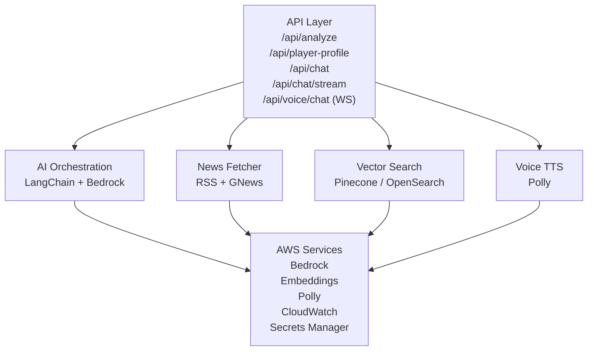

# Story Arc Tracker - Narrative Intelligence Platform

**Transform real-world events into structured story narratives with AI-powered analysis and interactive visualization.**

A full-stack platform combining news retrieval, semantic search, and AI reasoning to analyze complex narratives through timeline visualization, relationship graphs, and conversational AI.

---

## Table of Contents

- [Quick Start (5 Minutes)](#quick-start-5-minutes)
- [Features & Capabilities](#features--capabilities)
- [Tech Stack & Architecture](#tech-stack--architecture)
- [AI Orchestration Deep-Dive](#ai-orchestration-deep-dive)
- [Prerequisites](#prerequisites)
- [Installation & Setup](#installation--setup)
- [Configuration Reference](#configuration-reference)
- [API Reference](#api-reference)
- [Frontend User Guide](#frontend-user-guide)
- [Project Structure](#project-structure)
- [Development Workflow](#development-workflow)
- [Deployment Guide](#deployment-guide)
- [Troubleshooting & FAQ](#troubleshooting--faq)
- [Known Limitations](#known-limitations)
- [Support](#support)

---

## Quick Start (5 Minutes)

Get the application running locally for development and testing.

### Prerequisites (Install First)
- **Node.js** v18+ → Download from [nodejs.org](https://nodejs.org/)
- **Python** v3.10+ → Download from [python.org](https://www.python.org/)
- **AWS Credentials** → Required for AWS Bedrock and Polly services

### Backend Setup
```bash
cd backend

# Create Python virtual environment
python -m venv venv
# On Windows:
venv\Scripts\activate
# On macOS/Linux:
source venv/bin/activate

# Install dependencies
pip install -r requirements.txt

# Create .env file with your AWS credentials and API keys
# (See Configuration Reference section below for full details)
echo AWS_REGION=us-east-1 >> .env

# Start the backend server on http://localhost:8000
python -m uvicorn app.main:app --reload --port 8000
```

### Frontend Setup (New Terminal)
```bash
cd ..  # Return to project root

# Install dependencies
npm install

# Start development server on http://localhost:3000
npm run dev
```

### Verify It Works
```bash
# In a third terminal, test the health endpoint:
curl http://localhost:8000/health
# Expected response: {"status": "ok"}

# Open http://localhost:3000 in your browser
# You should see the Story Arc Tracker dashboard
```

---

## Features & Capabilities

- **Story Analysis** — Extract timeline events, players, relationships, and narrative arcs with sentiment/impact classification
- **Player Profiles** — Deep-dive analysis with motivations, alliances, conflicts, and risk assessments
- **Semantic Search** — Vector-based news retrieval with Pinecone or OpenSearch
- **Interactive Timeline** — Chronological events with citations, impact indicators, and sentiment coloring
- **Relationship Graph** — React Flow visualization of player networks and interactions
- **Topic-Aware Chat** — Ask questions grounded in timeline context with streaming responses
- **Voice Chat** — Real-time WebSocket-based voice interaction with Amazon Polly TTS
- **Source Policy** — Citation validation, URL canonicalization, allowlist enforcement
- **Quality Checks** — Fallback chains, structured output validation, confidence-based content refresh

---

## Tech Stack & Architecture

### Frontend Stack
- **React 19** — Modern component-based UI framework
- **TypeScript** — Type-safe JavaScript for robustness
- **Vite 6** — Lightning-fast build tool with HMR (hot module replacement)
- **Tailwind CSS 4** — Utility-first styling framework
- **React Flow 12** — Interactive network graph visualization
- **Recharts** — Composable charting library for timelines
- **Motion** — Animation library for smooth transitions
- **html-to-image** — Export charts as images

### Backend Stack
- **FastAPI** — Modern async Python web framework with auto-documentation
- **Uvicorn** — ASGI server for running FastAPI applications
- **LangChain 1.2** — LLM orchestration framework for prompt management and model chaining
- **LangChain AWS** — AWS Bedrock integration layer
- **Pydantic 2** — Data validation and serialization using Python type hints
- **Python 3.10+** — Type hints and modern async/await patterns

### AI & ML Services
- **AWS Bedrock** — Managed LLM API supporting multiple foundation models (Amazon Nova, Mistral)
  - Default Model: `amazon.nova-pro-v1:0` (complex analysis)
  - Simple Model: `amazon.nova-2-lite-v1:0` (lightweight requests)
  - Chat Model: `amazon.nova-2-lite-v1:0` (conversational responses)
  - Voice Model: `amazon.nova-2-sonic-v1:0` (fast voice responses)
  - Fallback: `mistral.mistral-large-3-675b-instruct`
- **AWS Bedrock Embeddings** — Amazon Titan Embed Text v2.0 for semantic search vectors
- **Amazon Polly** — Neural text-to-speech
- **Google Gemini** — Optional fallback (legacy)

### Data Services



### Data Flow: User Analysis Request

```
1. User enters topic + optional filters (dates, timeline_id, sources)
           │
           ▼
2. POST /api/analyze
           │
           ▼
3. news_fetcher.fetch_news_context()
   - Vector search Pinecone/OpenSearch with filters
   - Fallback to RSS/GNews if empty
           │
           ▼
4. ai_orchestration.analyze_story()
   - Construct LangChain prompt with news context
   - Select model: default (nova-pro) or simple (nova-lite)
   - Call AWS Bedrock ConverseLLM
   - Validate Pydantic StoryData schema
   - Retry with fallback model on failure
           │
           ▼
5. source_validator.validate_citations()
   - Canonicalize URLs (normalize schemes, trailing slashes)
   - Check domain/source allowlist (if strict mode enabled)
   - Reject response if violations found
           │
           ▼
6. Return StoryData to frontend
   - timeline: chronological events
   - players: entities with types and sentiment
   - relationships: connections (alliance/conflict/neutral)
   - arcs: narrative groupings
   - insights: analysis conclusions
   - news_context: source articles
           │
           ▼
7. Frontend visualization
   - Build connected components graph from relationships
   - Render timeline with charts and event cards
   - Display player network using React Flow
   - Ready for chat, deep-dive, or voice interaction
```

---

## AI Orchestration Deep-Dive

This section documents how the backend's LLM agents are structured, how a chat/voice request actually flows through the system, and how failures are contained at each tier. It complements the high-level [Tech Stack & Architecture](#tech-stack--architecture) section above with the internal agent design.

### System Architecture Diagram


### Agent Roles & Configurations

The system operates as a strictly orchestrated pipeline of specialized LLM chains ("Agents") powered by AWS Bedrock, rather than an unconstrained swarm.

- **Chat Agent** (`_chat_model`) — The primary conversational engine. It answers user queries grounded entirely in pre-analyzed `story_context` (historical timelines) and enforces a strict Pydantic JSON schema (`ChatAnswer`) for all outputs.
- **Voice Agent** (`_voice_model`) — A specialized iteration of the Chat Agent tailored for voice-to-text inputs. It generates responses optimized for TTS (Text-to-Speech) brevity and natural conversational cadence.
- **Analysis & Profiling Agents** (`_select_primary_model`) — The data-processing heavyweights:
  - *The Story Analyzer* evaluates raw news context to build structured `StoryData` (timelines, insights).
  - *The Profiler* analyzes related players, historical timelines, and relationship networks to construct deep-dive character or entity profiles.
  - *Note:* These agents dynamically route tasks to either a lightweight or heavyweight LLM based on context size (`_is_simple_request`) to optimize latency and cost.

### Communication Flow & Orchestration

The backend utilizes a synchronous orchestration pipeline augmented with asynchronous (`asyncio`) tool calls.

1. **Ingestion & Structuring** — The FastAPI router receives a query and historical timeline slice. It validates the payload and passes it to the AI Orchestrator.
2. **Initial Generation** — The Orchestrator compiles a LangChain prompt (injecting system constraints and allowed source policies) and invokes the Chat Agent to produce a draft response.
3. **The "Refresh" Evaluation (Quality Control)** — The generated draft is evaluated by the **Response Refresher**. A refresh is triggered if:
   - The provided timeline context is too thin (e.g., lacks sufficient events or citations).
   - The LLM's confidence score is suspiciously low, or it returns a generic fallback statement.
4. **Dynamic Context Retrieval (RAG)** — If a refresh is required, the system converts the query into vectors using Bedrock Embeddings and queries the Pinecone Vector DB.
5. **Re-Generation** — The Orchestrator intercepts the newly retrieved `fresh_news_evidence`, appends it to the prompt, and forces the Chat Agent to regenerate a stronger, highly grounded response.
6. **Guardrail Validation** — The finalized payload is pushed through the **Source Validator**, which strips disallowed domains and canonicalizes all cited URLs.
7. **Delivery** — The safe, verified payload is returned to the client as a single JSON object or a simulated NDJSON stream.

### Tool Integrations

The AI Agents are constrained and augmented by a deterministic tool ecosystem to ensure factual accuracy:

- **AWS Bedrock Converse API** — The core foundational model provider, utilizing `with_structured_output` to force the LLMs into emitting predictable data structures (avoiding parsing errors).
- **Pinecone Vector Database (OpenSearch)** — The primary retrieval tool. It filters documents dynamically using strict metadata constraints (source policies, domain allowlists, publication date windows).
- **RSS2JSON Proxy (Google News)** — A live internet scraping tool used *strictly* as a fallback when the internal vector database yields no results.
- **URL Canonicalization Engine** — A security and data-cleanliness tool that strips tracking parameters and validates parsed hostnames against internal whitelists.

### Multi-Tier Resiliency & Error-Handling

To prevent catastrophic failures during complex reasoning tasks, the architecture implements a multi-tier fallback strategy:

- **Tier 1: Model-Level Fallbacks** — Every primary LLM invocation is wrapped in an `_invoke_with_optional_fallback` chain. If the primary model fails to generate valid JSON or fails internal quality checks (e.g., empty insights), the prompt is automatically rerouted to a designated, higher-resiliency `_fallback_model`.
- **Tier 2: Retrieval Fallbacks** — Vector searches can be volatile. If Pinecone throws a timeout, connection error, or returns zero matches, the system intercepts the exception and silently pivots to the Live RSS Google News proxy to ensure the LLM still receives context.
- **Tier 3: Strict Policy Guardrails** — The system prioritizes safety over helpfulness. If an LLM hallucinates a citation or cites an unapproved domain, the Source Validator raises a `SourcePolicyViolationError`. This terminates the process and returns an actionable `422 Unprocessable Entity` error to the client outlining exactly which rule was broken.
- **Tier 4: Citation Coercion (Extreme Fallback)** — If all LLMs fail to format a response without crashing, the Orchestrator executes a hardcoded rescue protocol. It extracts the first valid citation from the raw `story_context` and constructs a pre-templated response (e.g., *"Based on [Source] reporting…"*). It sets the confidence score to `0.35` and adds a system note indicating a formatting failure occurred, ensuring the user interface does not break.

---

## Prerequisites

**System:** Node.js v18+, Python v3.10+, 4GB+ RAM, ~500MB disk
**AWS:** Bedrock access (models: nova-pro-v1, nova-2-lite-v1, nova-2-sonic-v1, mistral-large)
**Vector DB:** Pinecone or OpenSearch account

**AWS Credentials Setup:**
```bash
export AWS_ACCESS_KEY_ID=your_key
export AWS_SECRET_ACCESS_KEY=your_secret
export AWS_DEFAULT_REGION=us-east-1
# OR save to ~/.aws/credentials
```

**Vector DB (Pick One):**
- **Pinecone:** Sign up at pinecone.io, create index (dimension 1024, metric cosine)
- **OpenSearch:** Create AWS domain with KNN enabled

---

## Installation & Setup

### Backend (FastAPI)
```bash
cd backend
python -m venv venv
# Windows: venv\Scripts\activate
# macOS/Linux: source venv/bin/activate
pip install -r requirements.txt

# Create .env file with your config (see Configuration Reference)
cat > .env << EOF
AWS_REGION=us-east-1
BEDROCK_LLM_DEFAULT_MODEL_ID=amazon.nova-pro-v1:0
PINECONE_API_KEY=your_key
PINECONE_INDEX_HOST=your-index.pinecone.io
EOF

# Start server
python -m uvicorn app.main:app --reload --port 8000
```

### Frontend (React + Vite)
```bash
cd ..
npm install
npm run dev    # http://localhost:3000
```

**Verify:** Backend at http://localhost:8000/health, Frontend at http://localhost:3000

### Docker (Optional)
```bash
docker-compose up --build
# Backend: http://localhost:8000, Frontend: http://localhost:3000
```
See [docker-compose.yml](docker-compose.yml) template in the README's Deployment section.

---

## Configuration Reference

All configuration is managed via environment variables. Create a `.env` file in the `backend/` directory. See [.env.example](backend/.env.example) for the complete reference.

### Environment Variables (Complete)

| Variable | Type | Default | Required | Purpose |
|----------|------|---------|----------|---------|
| **AWS Configuration** | | | | |
| `AWS_REGION` | string | `us-east-1` | Yes | AWS region for Bedrock, Polly, etc. |
| **Bedrock LLM Models** | | | | |
| `BEDROCK_LLM_DEFAULT_MODEL_ID` | string | `amazon.nova-pro-v1:0` | Yes | Model for complex analysis (story analysis) |
| `BEDROCK_LLM_SIMPLE_MODEL_ID` | string | `amazon.nova-2-lite-v1:0` | Yes | Model for lightweight requests |
| `BEDROCK_LLM_CHAT_MODEL_ID` | string | `amazon.nova-2-lite-v1:0` | Yes | Model for chat responses |
| `BEDROCK_LLM_VOICE_MODEL_ID` | string | `amazon.nova-2-sonic-v1:0` | Yes | Model for voice responses (optimized for latency) |
| `BEDROCK_LLM_FALLBACK_MODEL_ID` | string | `mistral.mistral-large-3-675b-instruct` | No | Fallback if primary models fail |
| `BEDROCK_LLM_TEMPERATURE` | float | `0.2` | No | Model temperature (0=deterministic, 1=creative) |
| `BEDROCK_LLM_SIMPLE_CONTEXT_CHAR_THRESHOLD` | int | `6000` | No | Character threshold for simple vs. default model |
| `BEDROCK_LLM_ENABLE_FALLBACK` | bool | `true` | No | Enable fallback model chain on failure |
| **Bedrock Embeddings** | | | | |
| `BEDROCK_EMBEDDING_MODEL_ID` | string | `amazon.titan-embed-text-v2:0` | Yes | Embedding model for vector DB |
| `BEDROCK_EMBEDDING_DIMENSIONS` | int | `1024` | No | Embedding vector dimension |
| `BEDROCK_EMBEDDING_NORMALIZE` | bool | `true` | No | Normalize embeddings (recommended) |
| **Pinecone Vector DB** | | | | |
| `PINECONE_API_KEY` | string | `` | Conditional | API key for Pinecone (if using Pinecone) |
| `PINECONE_INDEX_HOST` | string | `` | Conditional | Pinecone host URL (e.g., `prod-abc.pinecone.io`) |
| `PINECONE_TOP_K` | int | `12` | No | Number of results per semantic search query |
| `PINECONE_NAMESPACE` | string | `all_timelines` | No | Pinecone namespace for isolation |
| `PINECONE_USE_TIMELINE_NAMESPACE` | bool | `false` | No | Use timeline_id as namespace prefix |
| `PINECONE_TIMEOUT_SECONDS` | int | `15` | No | Request timeout |
| `PINECONE_MAX_RETRIES` | int | `3` | No | Retry attempts on failure |
| **OpenSearch Vector DB** | | | | |
| `OPENSEARCH_HOST` | string | `` | Conditional | OpenSearch domain URL (if using OpenSearch) |
| `OPENSEARCH_INDEX_NAME` | string | `timeline_chunks` | No | Index name for chunks |
| `OPENSEARCH_TOP_K` | int | `12` | No | Results per search |
| `OPENSEARCH_TIMEOUT_SECONDS` | int | `15` | No | Request timeout |
| `OPENSEARCH_MAX_RETRIES` | int | `3` | No | Retry attempts |
| **Voice Settings** | | | | |
| `VOICE_DUPLEX_ENABLED` | bool | `true` | No | Enable duplex (simultaneous input/output) mode |
| `VOICE_SAMPLE_RATE_HZ` | int | `16000` | No | Audio sample rate (Hz) |
| `VOICE_OUTPUT_CHUNK_BYTES` | int | `3200` | No | TTS output chunk size (bytes) |
| `VOICE_TTS_VOICE_ID` | string | `Joanna` | No | Amazon Polly voice (Joanna, Matthew, Aria, etc.) |
| `VOICE_STT_SILENCE_TIMEOUT_MS` | int | `900` | No | Silence timeout for speech end detection (ms) |
| `VOICE_STT_MAX_SILENCE_MS` | int | `12000` | No | Max total silence before forcing utterance end (ms) |
| `VOICE_STT_PARTIAL_TIMEOUT_MS` | int | `2500` | No | Timeout for partial transcription updates (ms) |
| `VOICE_STT_RECONNECT_BACKOFF_MS` | int | `350` | No | Backoff delay on WebSocket reconnect (ms) |
| **Source Policy (Citation Validation)** | | | | |
| `SOURCE_POLICY_STRICT_ALLOWLIST_VALIDATION` | bool | `false` | No | Enforce strict allowlist checking (reject non-allowlisted) |
| `SOURCE_POLICY_ALLOWED_DOMAINS` | list[str] | `[]` | No | CSV list of allowed domains (e.g., `bbc.com,reuters.com`) |
| `SOURCE_POLICY_ALLOWED_SOURCE_IDS` | list[str] | `[]` | No | CSV list of allowed news source IDs |
| `SOURCE_POLICY_SOURCE_ALIASES` | dict | `{}` | No | Mappings for source ID aliases |
| `SOURCE_POLICY_FALLBACK_TEXT` | string | `I don't have enough...` | No | Error message when policy violations detected |
| `SOURCE_POLICY_REFRESH_CONFIDENCE_THRESHOLD` | float | `0.45` | No | Re-fetch with fresh news if confidence < threshold |
| `SOURCE_POLICY_REFRESH_MIN_TIMELINE_EVENTS` | int | `2` | No | Min events required for refresh |
| `SOURCE_POLICY_REFRESH_MIN_CITATIONS` | int | `2` | No | Min citations required for refresh |
| `SOURCE_POLICY_REFRESH_MAX_RESULTS` | int | `6` | No | Max fresh results to append |
| **Chat Configuration** | | | | |
| `CHAT_STREAM_SIMULATED_DELAY_MS` | int | `0` | No | Simulate network delay for testing (ms) |
| **Optional: Google Gemini Fallback** | | | | |
| `GEMINI_API_KEY` | string | `` | No | Gemini API key for fallback (legacy support) |

### Configuration by Use Case

#### Local Development (Quick Start)
```ini
AWS_REGION=us-east-1
BEDROCK_LLM_DEFAULT_MODEL_ID=amazon.nova-pro-v1:0
BEDROCK_LLM_SIMPLE_MODEL_ID=amazon.nova-2-lite-v1:0
BEDROCK_LLM_CHAT_MODEL_ID=amazon.nova-2-lite-v1:0
BEDROCK_LLM_VOICE_MODEL_ID=amazon.nova-2-sonic-v1:0
BEDROCK_EMBEDDING_MODEL_ID=amazon.titan-embed-text-v2:0

PINECONE_API_KEY=your_key
PINECONE_INDEX_HOST=your-index.pinecone.io

VOICE_DUPLEX_ENABLED=true
VOICE_TTS_VOICE_ID=Joanna
```

#### Production (Strict Validation)
```ini
AWS_REGION=us-east-1
BEDROCK_LLM_TEMPERATURE=0.1
BEDROCK_LLM_ENABLE_FALLBACK=true

SOURCE_POLICY_STRICT_ALLOWLIST_VALIDATION=true
SOURCE_POLICY_ALLOWED_DOMAINS=bbc.com,reuters.com,apnews.com
SOURCE_POLICY_REFRESH_CONFIDENCE_THRESHOLD=0.5

VOICE_DUPLEX_ENABLED=true
```

#### Cost-Optimized (Lightweight Models)
```ini
BEDROCK_LLM_DEFAULT_MODEL_ID=amazon.nova-2-lite-v1:0
BEDROCK_LLM_SIMPLE_MODEL_ID=amazon.nova-lite-v1:0
BEDROCK_LLM_ENABLE_FALLBACK=false

PINECONE_TOP_K=6
OPENSEARCH_TOP_K=6
```

#### Voice-Only (No Chat)
```ini
VOICE_DUPLEX_ENABLED=true
VOICE_TTS_VOICE_ID=Aria
BEDROCK_LLM_VOICE_MODEL_ID=amazon.nova-2-sonic-v1:0

# Disable chat models if cost-sensitive
```

---

## API Reference

### Health Check

#### `GET /health`
System health check endpoint.

**Response:**
```json
{
  "status": "ok"
}
```

**Status Code:** `200 OK`

---

### Story Analysis

#### `POST /api/analyze`
Analyze a topic and return structured narrative data including timeline events, players, relationships, and insights.

**Request Body:**
```json
{
  "topic": "The OpenAI board saga",
  "timeline_id": "us_iran_conflict",
  "published_from": "2026-01-01T00:00:00Z",
  "published_to": "2026-03-31T23:59:59Z",
  "sources": ["bbc.com", "reuters.com"]
}
```

**Request Parameters:**

| Field | Type | Required | Purpose |
|-------|------|----------|---------|
| `topic` | string | Yes | Topic to analyze (e.g., "US-Iran diplomatic tensions") |
| `timeline_id` | string | No | Filter to timeline (e.g., `budget_2026`, `israel_palestine_conflict`, `us_iran_conflict`) |
| `published_from` | ISO datetime | No | Earliest publication date (filter news) |
| `published_to` | ISO datetime | No | Latest publication date (filter news) |
| `sources` | list[string] | No | Allowed news source domains (e.g., `["bbc.com", "reuters.com"]`) |

**Response (200 OK):**
```json
{
  "timeline": [
    {
      "id": "evt_001",
      "date": "2026-03-25T00:00:00Z",
      "title": "Diplomatic Summit Announced",
      "description": "US and Iranian representatives announce formal negotiations...",
      "impact_level": "high",
      "sentiment": "neutral",
      "involved_players": ["USA", "Iran"]
    }
  ],
  "players": [
    {
      "id": "player_usa",
      "name": "USA",
      "type": "country",
      "role": "Primary negotiator",
      "sentiment": 0.1
    },
    {
      "id": "player_iran",
      "name": "Iran",
      "type": "country",
      "role": "Counter-negotiator",
      "sentiment": -0.1
    }
  ],
  "relationships": [
    {
      "source_id": "player_usa",
      "target_id": "player_iran",
      "type": "conflict",
      "strength": 0.8,
      "description": "Historical adversarial relationship"
    }
  ],
  "arcs": [
    {
      "id": "arc_001",
      "name": "Diplomatic Thaw",
      "description": "Moving toward peaceful resolution...",
      "events": ["evt_001", "evt_002"]
    }
  ],
  "insights": {
    "state_of_play": "Tensions escalating despite announcement; both sides maintaining military readiness.",
    "turning_points": [
      "March 25: Diplomatic outreach signals shift in approach"
    ],
    "key_patterns": [
      "Public statements more conciliatory than military posturing",
      "Third-party mediation crucial to success"
    ]
  },
  "news_context": [
    {
      "url": "https://bbc.com/news/article",
      "title": "US and Iran Begin Negotiations",
      "source": "bbc.com",
      "published_at": "2026-03-25T10:30:00Z",
      "snippet": "After weeks of back-channel discussions..."
    }
  ],
  "fetched_at": "2026-03-29T14:22:15Z"
}
```

---

### Chat

#### `POST /api/chat`
Ask a question about the analyzed story. Response is grounded in the timeline context.

**Request Body:**
```json
{
  "topic": "US-Iran diplomatic tensions",
  "message": "Why is Iran interested in negotiations at this moment?",
  "history": [
    {
      "role": "user",
      "content": "What are the main issues?"
    },
    {
      "role": "assistant",
      "content": "The main issues are..."
    }
  ],
  "timeline_slice": [
    {
      "id": "evt_001",
      "date": "2026-03-25T00:00:00Z",
      "title": "Diplomatic Summit Announced",
      "description": "..."
    }
  ]
}
```

**Response (200 OK):**
```json
{
  "message": "Iran is motivated by economic pressures and the need to demonstrate diplomatic progress to domestic audiences. The timing aligns with regional de-escalation signals from neighboring countries...",
  "citations": [
    {
      "url": "https://reuters.com/iran-sanctions",
      "snippet": "Iranian officials express desire to ease economic burden..."
    }
  ],
  "confidence": 0.87,
  "outside_topic": false,
  "suggested_followups": [
    "What domestic pressures is Iran facing?",
    "How does this compare to previous negotiation attempts?"
  ]
}
```

**Error Responses:**

| Status | Meaning |
|--------|---------|
| `400` | Missing required fields |
| `422` | Citation policy violation |
| `500` | Response generation failed |

---

### Streaming Chat

#### `POST /api/chat/stream`
Stream chat responses as newline-delimited JSON (NDJSON). Each line is a separate event.

**Request Body:**
Same as `/api/chat`

**Response Stream (200 OK, Content-Type: application/x-ndjson):**
```
{"type": "delta", "delta": "Iran "}
{"type": "delta", "delta": "is "}
{"type": "delta", "delta": "motivated "}
...
{"type": "final", "answer": {"message": "Iran is motivated...", "citations": [...], "confidence": 0.87}}
```

**Stream Event Types:**

| Type | Format | Purpose |
|------|--------|---------|
| `delta` | `{"type": "delta", "delta": "word "}` | Streaming text token |
| `final` | `{"type": "final", "answer": {...}}` | Complete response (matches `/api/chat` response) |
| `error` | `{"type": "error", "error": "Policy violation"}` | Error message |

---

### Real-Time Voice Chat (WebSocket)

#### `WebSocket /api/voice/chat`
Duplex audio conversation with streaming STT input and TTS output. Supports barge-in (user interrupt).

**Connection:**
```javascript
const ws = new WebSocket('ws://localhost:8000/api/voice/chat');
```

**Client → Server (JSON):**
```json
{
  "type": "audio_start"
}
```

**Client → Server (Binary):**
PCM16 audio chunk (mono, 16kHz, 16-bit signed samples). Structure:
```
[2 bytes: sample 1] [2 bytes: sample 2] ...
```

**Client → Server (Special Commands):**
```json
{"type": "barge_in"}
```

**Server → Client (JSON):**

| Event | Format | Meaning |
|-------|--------|---------|
| `session_ready` | `{"type": "session_ready", "model": "nova-2-sonic"}` | WebSocket initialized, ready for audio |
| `assistant_delta` | `{"type": "assistant_delta", "delta": "Iran"}` | Streaming text output |
| `assistant_audio_start` | `{"type": "assistant_audio_start", "language": "en-US"}` | TTS audio starting |
| `assistant_audio_chunk` | `{"type": "assistant_audio_chunk", "audio_bytes": "base64-encoded-pcm16"}` | Audio chunk (base64) |
| `assistant_audio_end` | `{"type": "assistant_audio_end"}` | TTS audio finished |
| `assistant_final` | `{"type": "assistant_final", "answer": {...}, "metrics": {"first_token_ms": 120, "first_audio_ms": 450, "final_ms": 2340}}` | Complete response + latency metrics |
| `barge_in_ack` | `{"type": "barge_in_ack"}` | User barge-in acknowledged; output paused |
| `error` | `{"type": "error", "error": "invalid audio format"}` | Error message |

**Example Flow - JavaScript:**
```javascript
const ws = new WebSocket('ws://localhost:8000/api/voice/chat');

ws.onopen = () => {
  ws.send(JSON.stringify({type: 'audio_start'}));
};

ws.onmessage = (event) => {
  const msg = JSON.parse(event.data);

  if (msg.type === 'session_ready') {
    console.log('Ready to send audio');
    // Start capturing user microphone and sending PCM16 chunks
  } else if (msg.type === 'assistant_delta') {
    console.log('Text:', msg.delta);  // Display streaming text
  } else if (msg.type === 'assistant_audio_chunk') {
    // Decode base64, play PCM16 audio
    const audioBytes = atob(msg.audio_bytes);
    audioContext.play(audioBytes);
  } else if (msg.type === 'assistant_final') {
    console.log('Latencies:', msg.metrics);
  }
};

// Send audio chunk
const pcm16Chunk = /* mono, 16-bit signed, 16kHz */;
ws.send(pcm16Chunk);

// User interrupt
ws.send(JSON.stringify({type: 'barge_in'}));
```

---

## Frontend User Guide

### Main Dashboard Overview

**Components:**
1. **Topic Input** — Enter text topic (e.g., "US-Iran tensions", "2026 budget debate")
2. **Filters Panel** — Optional: date range, timeline selection, source domains
3. **Analyze Button** — Triggers `/api/analyze` request
4. **Loading Progress** — Cycling status messages during analysis ("Fetching news...", "Analyzing narrative...")
5. **Timeline View** — Chronological events display (default) or reverse chronological
6. **Relationship Graph** — Interactive network of players and connections
7. **Insights Panel** — State-of-play, turning points, key patterns
8. **Chat Panel** — Ask questions about the analyzed story
9. **Voice Chat** — Real-time voice conversation (if enabled)

### Timeline View

**Features:**
- **Lead Event** — Most impactful or recent event displayed prominently at the top
- **Side Events** — Supporting context events shown in chronological order
- **Event Cards** — Each shows:
  - Title
  - Date
  - Impact level (Low | Medium | High) with color coding
  - Sentiment (Positive | Neutral | Negative)
  - Involved players (clickable → deep-dive)
  - Description
  - Citations with source links and publication dates
- **Sorting Options:**
  - By date (ascending/descending)
  - By impact (high → low)
  - Default (lead + side events)
- **Filtering:**
  - By player (show only events involving X)
  - By narrative arc
  - By impact level

**How to Use:**
1. Timeline auto-populates after `/api/analyze` completes
2. Hover over event cards to highlight related players
3. Click player name → opens deep-dive modal
4. Click source URL → opens article in new tab
5. Use filter dropdowns to narrow view

### Relationship Graph (React Flow)

**Visual Elements:**
- **Nodes:** Player entities
  - **Blue circles** — Individuals (person type)
  - **Green squares** — Organizations/Companies (company type)
  - **Purple diamonds** — Countries (country type)
  - Node size → based on event involvement frequency
  - Sentiment color shade → red (negative) to green (positive)
  - Labeled with player name and sentiment score

- **Edges:** Relationships between players
  - **Solid line** — Alliance (strength indicated by thickness)
  - **Dashed line** — Conflict (thickness = intensity)
  - **Dotted line** — Neutral relationship
  - Arrow direction — unidirectional or bidirectional influence
  - Hover shows relationship description

**Interactions:**
- **Click node** → Highlights connected nodes; dims others; opens deep-dive modal
- **Drag node** → Reposition for better visualization
- **Double-click node** → Center view on node
- **Zoom** — Scroll wheel or pinch gesture
- **Pan** — Click and drag background
- **Fit to view** — Double-click background or use UI button

**Layout Modes:**
- **Default** — Force-directed layout (automatic spacing)
- **Circular** — Ring layout by player type
- **Hierarchical** — Top-down by centrality (degree)
- **Compact** — If graph has >14 nodes or >26 edges, use compact mode for clarity

### Deep-Dive Player Profile Modal

**Sections:**
1. **Summary** — Executive overview of player's role in story
2. **Role in Story** — Detailed narrative position and influence
3. **Motivations** — Inferred goals, objectives, constraints
4. **Alliances** — Allied players with relationship strength (0-1) and description
5. **Conflicts** — Adversarial relationships with intensity
6. **Timeline Contributions** — Key events player influenced or triggered
7. **Risk Score** — Strategic risk assessment (0 = low risk, 1 = high risk)
8. **Outlook** — Predicted future trajectory and likely moves
9. **Citations** — Supporting sources for profile claims

**Actions:**
- Close modal — Esc key or click X
- Expand sections — Click arrow to show/hide details
- Click related player → Switches modal to that player
- Export profile — Download as PDF or JSON

### Chat Panel

**Features:**
- **Message History** — Displays conversation with AI
- **Input Box** — Enter questions about the story
- **Suggested Follow-ups** — Click to explore related questions
- **Citations** — Each response shows source evidence:
  - Source URL
  - Snippet from article
  - Publication date
- **Confidence Score** — Indicates how well-grounded the response is (0-1)
- **Off-Topic Detection** — Alert if question is outside story scope

**Usage:**
1. Timeline must be analyzed first
2. Type question (e.g., "Why did Iran decide to negotiate?")
3. Press Enter or click Send
4. Response streams in real-time with citations
5. Click citation links to read source articles
6. Ask follow-up questions using suggested prompts or type your own

### Voice Chat Interface

**Prerequisites:**
- Microphone connected and permission granted
- WebSocket support in browser (all modern browsers)
- Backend running with voice enabled (`VOICE_DUPLEX_ENABLED=true`)

**Controls:**
- **Microphone Button** — Click to start/stop recording
- **Status Indicator:**
  - 🟢 Green: Listening (recording user audio)
  - 🔵 Blue: Processing (sending audio to backend)
  - 🟡 Yellow: Responding (AI generating response)
  - ⚫ Black: Idle

**How to Use:**
1. Click Microphone button to start
2. Speak your question naturally (e.g., "Who is winning in this conflict?")
3. Voice recognition transcription appears in real-time
4. After you finish (silence detected), AI begins responding
5. Listen to audio response (play sound icon)
6. Read transcribed response + citations below
7. Interrupt anytime by clicking Microphone button again (barge-in)
8. Click stop to exit voice mode

**Latency Metrics:**
After each response:
- **First Token** — Time until AI starts generating (ms)
- **First Audio** — Time until audio output starts playing (ms)
- **Final** — Total response time (ms)

**Troubleshooting Voice:**
- **No audio input captured** → Check browser microphone permissions (click address bar lock icon)
- **Slow response** → Check network latency (`ping localhost:8000`); may need to restart backend
- **Audio cuts off** — Silence timeout may be too short; check `VOICE_STT_SILENCE_TIMEOUT_MS` setting
- **Microphone not detected** → Use `https://` (not `http://`) if deploying to server; Chromium requires secure context for audio

### Filtering & Sorting

**Filters (left panel):**
```
[ Date Range: 2026-01-01 to 2026-03-31 ]
[ Timeline: All / Budget 2026 / Israel-Palestine / US-Iran ]
[ Players: USA, Iran, Russia, ... ] (multi-select)
[ Impact Level: All / High / Medium / Low ]
[ Sentiment: All / Positive / Neutral / Negative ]
```

**Sorting (right panel):**
- Date (↑ ascending / ↓ descending)
- Impact (High → Low)
- Default (lead + side events)

**How to Use:**
1. Adjust filters → Timeline automatically updates
2. Multiple filters apply with AND logic (e.g., High Impact AND Positive Sentiment)
3. Reset all → Click "Clear Filters" button
4. Save view → (Not yet implemented; future feature)

### Keyboard Shortcuts

| Shortcut | Action |
|----------|--------|
| `Enter` | Submit chat message / Analyze topic |
| `Esc` | Close modal / Exit voice chat |
| `Ctrl+K` | Search/command palette (future) |
| `Ctrl+S` | Save current view as image (future) |
| `?` | Show help dialog |

---

## Project Structure

```
c:\Users\aryan\et-ai-hackathon/
│
├── README.md                       # This file
├── package.json                    # Frontend dependencies + scripts
├── tsconfig.json                   # TypeScript configuration
├── vite.config.ts                  # Vite dev server config (API proxy to :8000)
├── tailwind.config.js              # Tailwind CSS configuration (if exists)
├── postcss.config.js               # PostCSS configuration (if exists)
├── index.html                      # HTML entry point
│
├── src/                            # Frontend source code
│   ├── App.tsx                     # Main React component (root layout)
│   ├── main.tsx                    # React app initialization
│   ├── index.css                   # Global Tailwind styles
│   ├── voiceRecognitionLoop.ts     # WebSocket voice handling logic
│   └── components/                 # (Infer: UI components would be here)
│       └── [various UI components]
│
├── backend/                        # FastAPI backend
│   ├── app/
│   │   ├── __init__.py             # Package marker
│   │   ├── __main__.py             # Backend entry point (python -m app)
│   │   ├── main.py                 # FastAPI app creation + CORS config
│   │   ├── config.py               # Settings class (env var loading)
│   │   ├── constants.py            # Shared request/response constants
│   │   ├── schemas.py              # Pydantic models (StoryData, Player, etc.)
│   │   ├── prompts.py              # LangChain prompt templates
│   │   │
│   │   ├── routers/                # API endpoint handlers
│   │   │   ├── __init__.py
│   │   │   ├── health.py           # GET /health
│   │   │   ├── analyze.py          # POST /api/analyze
│   │   │   ├── chat.py             # POST /api/chat, /api/chat/stream
│   │   │   ├── profile.py          # POST /api/player-profile
│   │   │   ├── voice.py            # WebSocket /api/voice/chat
│   │   │   └── __pycache__/        # Compiled Python cache
│   │   │
│   │   └── services/               # Business logic services
│   │       ├── __init__.py
│   │       ├── ai_orchestration.py # LangChain + Bedrock LLM calls
│   │       │                       # analyze_story(),
│   │       │                       # generate_player_profile(),
│   │       │                       # generate_topic_chat_response(),
│   │       │                       # generate_topic_voice_response()
│   │       ├── news_fetcher.py     # News context retrieval
│   │       │                       # fetch_news_context(),
│   │       │                       # fetch_live_news_context()
│   │       ├── bedrock_embeddings.py   # Embedding service wrapper
│   │       ├── vector_search.py    # Pinecone/OpenSearch queries
│   │       ├── source_validator.py # Citation policy enforcement
│   │       ├── source_policy.py    # Policy config management
│   │       ├── response_refresh.py # Refresh with fresh news on low confidence
│   │       ├── url_canonicalization.py # URL normalization
│   │       ├── voice_tts.py        # Amazon Polly TTS wrapper
│   │       └── __pycache__/
│   │
│   ├── requirements.txt            # Python dependencies
│   ├── .env.example                # Template for .env (not in repo)
│   └── __pycache__/                # Compiled Python cache
│
├── tests/                          # Python unit tests
│   ├── test_analyze_router.py
│   ├── test_chat_orchestration.py
│   ├── test_chat_router.py
│   ├── test_config_settings.py
│   ├── test_news_fetcher_fallback.py
│   ├── test_news_fetcher_vector_utils.py
│   ├── test_response_refresh.py
│   ├── test_retrieval_filters.py
│   ├── test_source_validator.py
│   ├── test_vector_search_filters.py
│   ├── test_voice_router.py
│   └── __pycache__/
│
├── data/                           # Pre-loaded datasets
│   ├── intermediate/               # Intermediate processing outputs
│   │   ├── candidates_budget_2026.jsonl
│   │   ├── candidates_israel_palestine_conflict.jsonl
│   │   └── candidates_us_iran_conflict.jsonl
│   │
│   └── processed/                  # Final processed data (vectors, chunks)
│       ├── articles_budget_2026.jsonl
│       ├── articles_israel_palestine_conflict.jsonl
│       ├── articles_us_iran_conflict.jsonl
│       ├── chunks_all_timelines.jsonl
│       ├── chunks_budget_2026.jsonl
│       ├── chunks_israel_palestine_conflict.jsonl
│       ├── chunks_us_iran_conflict.jsonl
│       ├── embed_checkpoint.json   # Embedding progress checkpoint
│       ├── ingestion_manifest.json # Metadata about ingested data
│       ├── failures_budget_2026.csv
│       ├── failures_israel_palestine_conflict.csv
│       └── failures_us_iran_conflict.csv
│
├── scripts/                        # Data processing & loading scripts
│   ├── prepare_three_timelines_chunks.py      # Split articles into chunks
│   ├── scrape_three_timelines.py              # Scrape news for 3 timelines
│   ├── load_vectors_bedrock_pinecone.py       # Embed + load to Pinecone
│   ├── load_vectors_bedrock_opensearch.py     # Embed + load to OpenSearch
│   ├── load_three_timelines_vectordb.py       # Universal loader
│   │
│   ├── data/                       # Local data copies for scripts
│   │   └── processed/
│   │       └── chunks_all_timelines.jsonl
│   │
│   └── providers/                  # Custom LangChain providers
│       ├── __init__.py
│       ├── adapters.py             # Provider-specific adaptations
│       └── __pycache__/
│
├── configs/                        # Configuration files
│   └── timeline_queries.yaml       # Pre-defined search queries for timelines
│
├── docs/                           # Documentation
│   └── dataset_spec_3_timelines.md # Dataset specification
│
└── metadata.json                   # Project metadata (name, description, etc.)
```

**Key Files to Know:**

| File | Responsibility |
|------|-----------------|
| `backend/app/main.py` | FastAPI app initialization, CORS setup, router mounting |
| `backend/app/schemas.py` | Pydantic models (StoryData, Player, Relationship, etc.) |
| `backend/app/config.py` | Environment variable loading and defaults |
| `backend/app/services/ai_orchestration.py` | LangChain + Bedrock orchestration for all AI requests |
| `backend/app/services/news_fetcher.py` | News retrieval via vector search or RSS fallback |
| `src/App.tsx` | Main React component (layout, state, API calls) |
| `vite.config.ts` | Dev server setup; proxies `/api/*` to backend |
| `requirements.txt` | Python package versions (FastAPI, LangChain, boto3, etc.) |

---

## Development Workflow

### Running Tests

#### Python Backend Tests
```bash
cd backend

# Install test dependencies (if not already)
pip install pytest pytest-asyncio

# Run all tests
pytest

# Run specific test file
pytest tests/test_analyze_router.py -v

# Run with coverage
pytest --cov=app tests/

# Run in watch mode (auto-run on file changes)
pytest-watch
```

#### Frontend Tests (TypeScript/JavaScript)
```bash
# From project root
npm run test

# Run specific test file
npm run test -- voiceRecognitionLoop.test.ts

# Watch mode
npm run test -- --watch

# Coverage
npm run test -- --coverage
```

### TypeScript Linting & Type Checking

```bash
# Type check (no emit)
npm run lint

# Or:
npx tsc --noEmit

# Fix formatting issues (if ESLint configured)
npx eslint src/ --fix
```

### Hot Module Replacement (HMR) During Development

Vite automatically reloads the browser when you edit React components:

1. **Frontend changes** → Browser auto-refreshes in <100ms
2. **Backend changes** → Use `--reload` flag (enabled by default):
   ```bash
   python -m uvicorn app.main:app --reload --port 8000
   ```
   Backend restarts automatically on Python file changes

### Building for Production

#### Frontend
```bash
# Create optimized production build
npm run build

# Output: dist/ directory with minified HTML/JS/CSS
# Size: ~200-300 KB total (gzipped)

# Preview production build locally
npm run preview
```

#### Backend
No build step needed; FastAPI runs Python directly. For production:
```bash
# Remove --reload flag
python -m uvicorn app.main:app --host 0.0.0.0 --port 8000

# With Gunicorn (for multiple workers):
pip install gunicorn
gunicorn app.main:app --workers 4 --worker-class uvicorn.workers.UvicornWorker
```

---

## Deployment Guide

### AWS EC2 (Recommended)

1. **Enable Bedrock Models:** AWS Console → Bedrock → Model Access → Request (nova-pro, nova-lite, nova-sonic, mistral-large)
2. **Launch EC2:** t3.medium, Amazon Linux 2023, IAM role with Bedrock + Polly permissions
3. **Install & Run:**
   ```bash
   git clone <repo>
   cd backend && python -m venv venv && source venv/bin/activate
   pip install -r requirements.txt && pip install gunicorn
   # Create .env file with API keys
   gunicorn app.main:app --workers 4 --bind 0.0.0.0:8000
   ```
4. **Frontend:** Build React (`npm run build`), upload `dist/` to S3, create CloudFront distribution
5. **Nginx Reverse Proxy:** Route `/api` to backend, `/` to CloudFront

### Docker + ECS (Scalable)

1. **Build:** `docker build -t story-arc/backend backend/` and `docker build -t story-arc/frontend .`
2. **Push to ECR:** `aws ecr push <image>`
3. **ECS Task Definition:** Set environment variables, secrets from AWS Secrets Manager
4. **Deploy:** Create ECS service with 2+ replicas, ALB for load balancing

### Scaling & Monitoring

- **Backend:** Auto-scale ECS tasks on CPU >70%
- **Frontend:** CloudFront CDN caches indefinitely
- **Vector DB:** Pinecone auto-scales; OpenSearch uses multi-node cluster
- **Monitoring:** CloudWatch Logs + Metrics; set alarms on error rate, latency

---

## Troubleshooting & FAQ

### Common Issues & Solutions

| Issue | Solution |
|-------|----------|
| Port 8000 in use | `lsof -i :8000 && kill -9 <PID>` or use `--port 8001` |
| Frontend can't reach backend | Check backend running, Vite proxy configured, CORS enabled |
| AWS credentials missing | Set `AWS_ACCESS_KEY_ID`, `AWS_SECRET_ACCESS_KEY`, `AWS_DEFAULT_REGION` |
| Bedrock model error | Enable model in AWS Bedrock console → Model access |
| Pinecone timeout | Verify API key, index host; load vectors via `load_vectors_bedrock_pinecone.py` |
| Voice not working | Use HTTPS, grant microphone permission, enable `VOICE_DUPLEX_ENABLED=true` |
| Analysis slow (>60s) | Reduce `PINECONE_TOP_K` or switch to `nova-2-lite` model |

### FAQ Quick Answers

- **Different LLM?** Modify `backend/app/services/ai_orchestration.py` to use ChatOpenAI, ChatAnthropic, etc.
- **Add dataset?** Place articles in `data/intermediate/`, run chunk script, load vectors, update config
- **Run without AWS?** Swap Bedrock for Ollama or Gemini in `ai_orchestration.py`
- **Reduce costs?** Use `nova-2-lite`, `PINECONE_TOP_K=6`, add Redis caching
- **Multiple users?** FastAPI scales with Gunicorn workers (4+); no shared state
- **Export to PDF?** Not built-in; add `html2pdf` dependency + `/api/export` endpoint
- **Multi-cloud?** Bedrock → Vertex AI/Azure OpenAI; Polly → Azure Speech Service; Pinecone works cross-cloud

---

## Known Limitations

1. **Analysis Freshness** — Data is pre-loaded (max 1-2 weeks old); live news fallback available via GNews
2. **Real-Time Updates** — No auto-refresh of analysis; user must re-analyze for latest
3. **Data Privacy** — News context & user queries sent to AWS Bedrock; check data residency requirements
4. **Supported Languages** — English only; LLM and voice models are English-optimized
5. **Maximum Topics** — No hard limit, but analysis time grows with data volume
6. **Concurrent Connections** — Limited by backend worker count and vector DB throughput
7. **Audio Quality** — Voice chat optimized for 16 kHz mono; no multi-language STT
8. **Export Format** — Timeline can be viewed/copied but no native PDF export
9. **Mobile** — UI not optimized for mobile; desktop recommended (>1024px screens)

---

## Acknowledgments

- **LangChain** — LLM orchestration framework
- **AWS Bedrock** — Managed LLM API with Nova models
- **Pinecone** — Managed vector database
- **React Flow** — Interactive network visualization
- **FastAPI** — Modern Python web framework
- **Tailwind CSS** — Utility-first CSS framework
